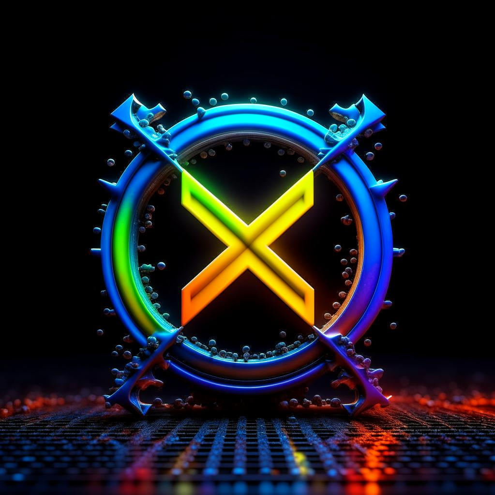

# D-THEXIUM: Blockchain Technology in the Chemical Industry

D-THEXIUM is a revolutionary machine-learning application/program that integrates blockchain technology with AI capabilities to address the challenges faced by the chemical industry. By leveraging a decentralized and tamper-proof ledger, smart contracts, and AI-driven data analysis, D-THEXIUM provides enhanced data integrity, security, and efficiency.

## Installation

Follow these step-by-step instructions to install D-THEXIUM:

1. Clone the repository: `git clone https://github.com/d-thexium.git`
2. Navigate to the project directory: `cd d-thexium`
3. Install the dependencies: `npm install`
4. Configure the application settings: `cp config.example.json config.json`
5. Start the application: `npm start`Make sure you have Node.js and npm installed on your machine before proceeding with the installation.

## License

This project is licensed under the [GPT License](https://github.com/S2much/D-THEX-ORION/blob/main/LICENSE).

## About

D-THEXIUM is a cutting-edge machine-learning application/program that aims to revolutionize the chemical industry. By combining blockchain technology, AI capabilities, and smart contracts, D-THEXIUM provides innovative solutions to the challenges faced by the industry. With enhanced data integrity, security, and efficiency, D-THEXIUM empowers chemical companies to optimize their operations and drive growth.

For more information, visit our website: [www.d-thexium.com](https://www.d-thexium.com)

